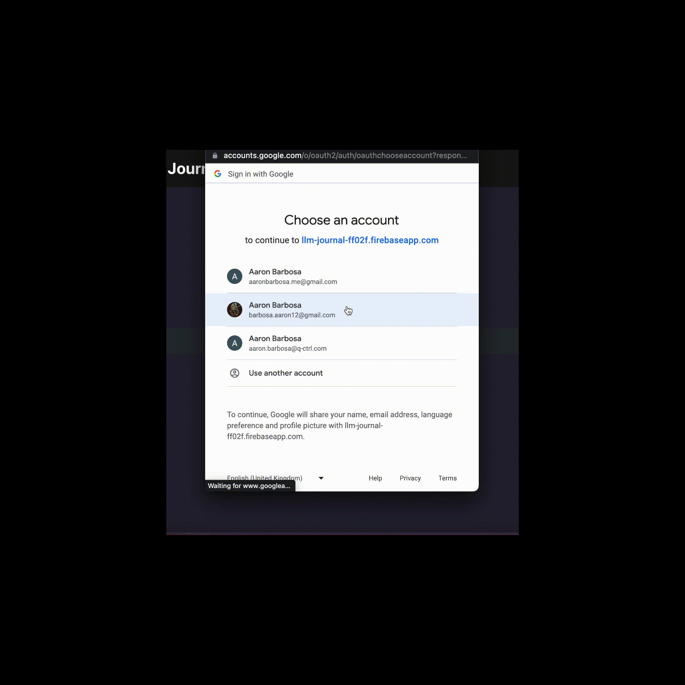

# llm-journal
AI-based chat application for self-reflection

  

  

This is a chat application for self-reflection and journaling. This application offers users an interactive experience where they can engage with an AI language model, creating a safe and supportive environment to explore their thoughts and ideas. The user's messages are transmitted to a dedicated Node.js backend, which processes the input and facilitates communication with the Open AI API for generating responses. To further enrich the AI model's understanding and deliver optimal responses, the application utilizes a vector database called Pinecone, which provides contextual information. The frontend of the application is developed using React, while user authentication and data management are handled through Firebase.

  

  

# What I've Learned
* How to write a basic application frontend using React
* How to create a Node.js server for serving application data
* How to create an API using Express
* How to integrate a large language model with a vector database for context search
* How to prompt an LLM for optimal output
* How to use Firebase for user authentication/storage
